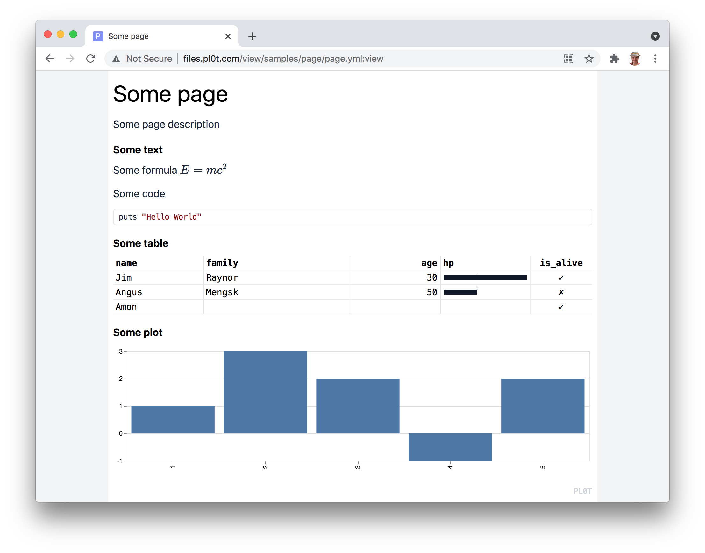

PL0T and **See the Data**

# Example



```Groovy
def page = new Page(title: 'Some page', desc: 'Some description')


page.text('Some text', """
Some formula \$E=mc^2\$

Some code `puts 'Hello World'`
""")


// Data as TidyData or Array or Column Array
def table_data = [
  [ name: 'Jim Raynor',   age: 30, hp: 250,  is_alive: true ],
  [ name: 'Angus Mengsk', age: 50, hp: 100,  is_alive: false ],
  [ name: 'Amon',                  hp: 500,  is_alive: true ]
]
page.table('Some table', table_data, [
  columns: [
    [ id: 'name' ],
    [ id: 'age' ],
    [ id: 'hp', format: [ type: 'line', ticks: [100] ] ],
    [ id: 'is_alive' ]
  ]
])


// Data as TidyData or Array or Column Array
chart_data = [
  a: [1, 2, 3,  4, 5],
  b: [1, 3, 2, -1, 2]
]
page.chart('Some chart', chart_data, [
  'bar',
  [ x: 'a', type: 'nominal' ],
  [ y: 'b' ]
])


// page.image('Some image', [
//   // Tiny black pixel encoded as base64 image.
//   // Also url could be supplied as `url: 'http://some-url'`.
//   base64: 'R0lGODlhAQABAIAAAAUEBAAAACwAAAAAAQABAAACAkQBADs='
// ])


// Saving report as HTML file, open it the Browser to see the Notebook
// You can publish Notebook by copying it to any Web Server
page.save('play.html')


// Optionally, you can publish Notebook on the http://pl0t.com site.
// You would need to get API Token from http://pl0t.com and store it as `plot_api_token` env variable
// The Notebook will be available as http://al6x.pl0t.com/groovy_test/page.json:view
// page.publish('http://al6x.pl0t.com/groovy_test/page.json')
```

For more examples checkout [online demos](http://pl0t.com).