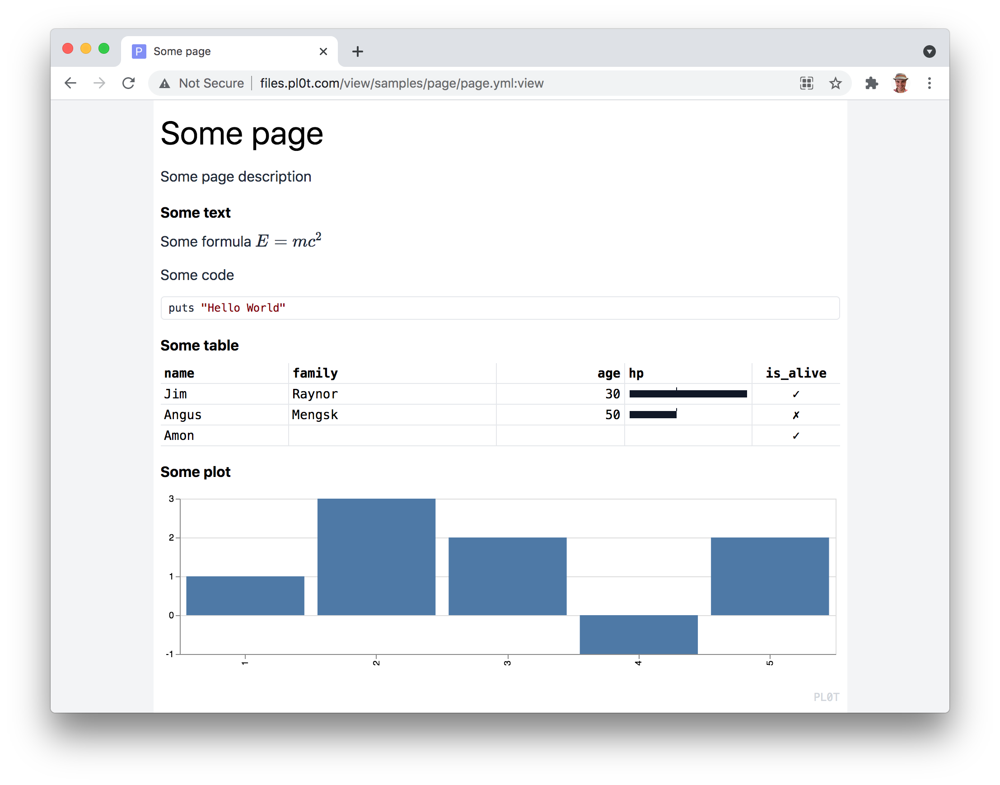

PL0T and **See the Data**

# Example



Install `nimble install pl0t`

```Nim
import pl0t
import std/strutils except `%`

# Optional, alters Nim 'json' module, to allow keys `%{ a: 1 }` instead of `%{ "a": 1 }`
import pl0t/jsonm


var page = Page.init %{
  title: "Some page",
  desc:  "Some description",
  # css:   "body { background-color: red !important; }" // Use for custom styling
}


page.text "Some text", """
  Some formula $E=mc^2$

  Some code `puts "Hello World"`
""".dedent


let table_data = @[
  (name: "Jim Raynor",   age: 30,     hp: 250,  is_alive: true ),
  (name: "Angus Mengsk", age: 50,     hp: 100,  is_alive: false ),
  (name: "Amon",         age: 30000,  hp: 500,  is_alive: true)
]
page.table "Some table", table_data, %{
  columns: [
    { id: "name" },
    { id: "age" },
    { id: "hp", format: { type: "line", ticks: [100] } },
    { id: "is_alive" }
  ]
}


let chart_data = (
  a: [1, 2, 3,  4, 5],
  b: [1, 3, 2, -1, 2]
)
page.chart "Some chart", chart_data, %[
  "bar",
  { x: "a", type: "nominal" },
  { y: "b" }
]


# page.image "Some image", %{
#   # Tiny black pixel encoded as base64 image.
#   # Also url could be supplied as `url: "http://some-url"`.
#   base64: "R0lGODlhAQABAIAAAAUEBAAAACwAAAAAAQABAAACAkQBADs="
# }


# Saving report as HTML file, open it the Browser to see the Notebook
# You can publish Notebook by copying it to any Web Server
page.save "play.html"


# Optionally, you can publish Notebook on the http://pl0t.com site.
# You would need to get API Token from http://pl0t.com and store it as `plot_api_token` env variable
# The Notebook will be available as http://al6x.pl0t.com/nim_test/page.json:view
# page.publish "http://al6x.pl0t.com/nim_test/page.json"
```

For all possible options checkout [online demos](http://pl0t.com) and the
  [data schema](https://github.com/al6x/pl0t/blob/main/files/view/schema/blocks.ts).
