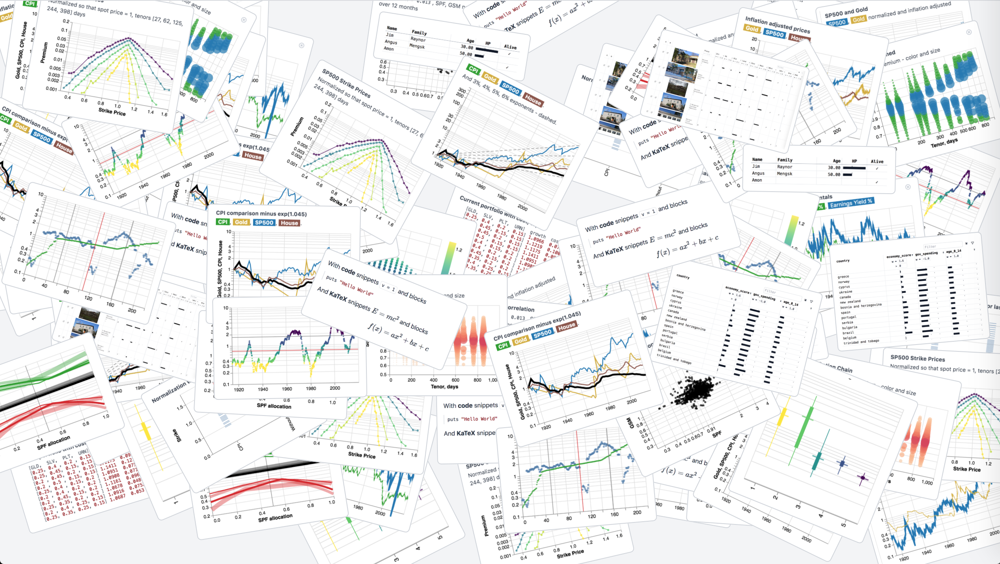

**PL0T and See the Data** http://pl0t.com

A plot document is **plain html**. You can open it **locally or share** on any site.

Example:

    plot="{chart:[bar,{x: a},{y: b}],data:{a:[1,2],b:[2,4]}}"
    curl -s http://pl0t.com/view.html | sed "s/{data}/$plot/" > play.html
    open play.html

Language API and more visit http://pl0t.com

